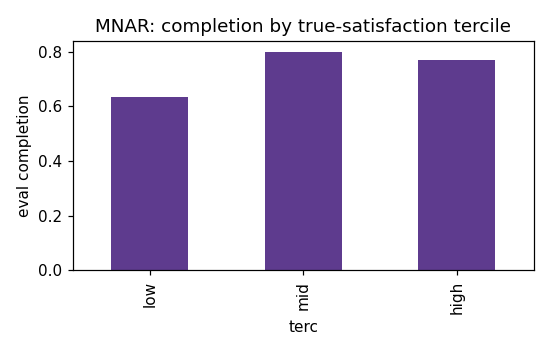
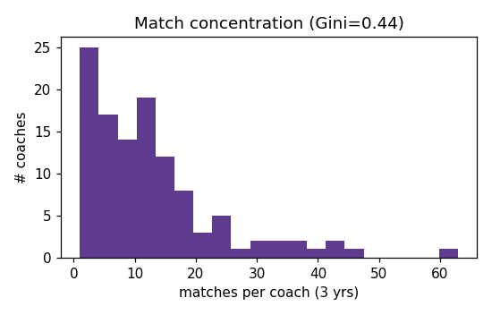
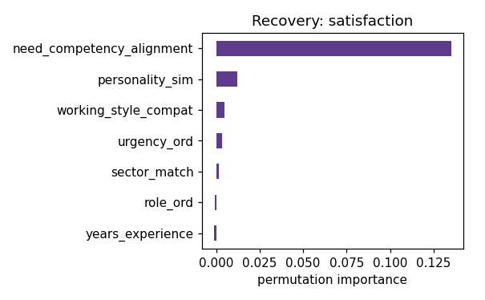
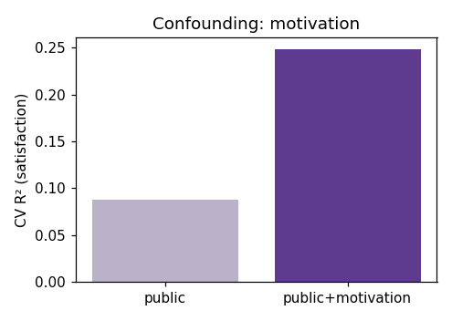

# Gingermood Synthetic Data — Validation Report

Seed `20250601` · 120 coaches · 2446 clients · 1480 trajectories · 7338 offers.

> **Realism caveat.** This is a Monte-Carlo *sandbox*. Signal-to-noise is deliberately favorable (clean tags, planted effects, modest noise) so the pipeline's recovery machinery can be verified. The R² values below are **sandbox diagnostics only** and must **never** be quoted as expected real-world predictive performance. This validates the PIPELINE, not the business thesis — the thesis is tested on real data later.

## 1. Marginals vs §6 anchors (±15% rel.)

| statistic | target | simulated | pass |
|---|---|---|---|
| client volume 2023 | 653 | 653 | ✅ |
| client volume 2024 | 852 | 852 | ✅ |
| client volume 2025 | 941 | 941 | ✅ |
| dropout 2023 | 0.167 | 0.174 | ✅ |
| dropout 2024 | 0.202 | 0.205 | ✅ |
| dropout 2025 | 0.207 | 0.209 | ✅ |
| first-shortlist failure | [0.3, 0.4] | 0.395 | ✅ |
| eval completion 2023 | 0.788 | 0.796 | ✅ |
| eval completion 2024 | 0.721 | 0.695 | ✅ |
| eval completion 2025 | 0.688 | 0.658 | ✅ |
| eval completion monotone ↓ | 2023>2024>2025 | 0.796 > 0.695 > 0.658 | ✅ |
| top coach matches/year | [25, 30] | 25 | ✅ |
| share coaches ≤2 matches/yr | ≥0.25 | 0.343 | ✅ |
| pool size | 120 | 120 | ✅ |
| joiners/year (in-window) | 8 | 8 | ✅ |
| leavers/year | 10 | 9 | ✅ |
| dropout reason order | disappeared>no-longer>external | disappeared > no-longer-wanted > external-coach | ✅ |

**17/17 anchors pass.**

## 2. Missingness check — MNAR gradient

Evaluation completion by year (monotone ↓ enforced): 2023=0.796, 2024=0.695, 2025=0.658

Completion by *true* satisfaction tercile (MNAR if rising):

| tercile | completion |
|---|---|
| low | 0.636 |
| mid | 0.800 |
| high | 0.770 |

MNAR gradient present: ✅ yes

## 3. Concentration check

Matches per coach (total): mean=12.9, max=63, Gini=0.435

## 4. Recovery test (public columns only, k-fold CV)

> **GBM regularization note (amendment 1).** Headline R² is 5-fold cross-validated. The gradient booster is deliberately regularized (`max_depth=3`, `min_samples_leaf=30`, `l2=1.0`, early stopping). The evaluated subset is small and **satisfaction is hard to predict from public columns by design** — its dominant driver, `motivation`, is a latent confounder — so an unregularized booster would overfit to a misleadingly negative CV R². Regularization yields an honest small-positive R²; the recovery claims rest on the *importance ranking* and *coefficient signs*, not the R² magnitude.

### satisfaction  (GBM 5-fold CV R² = 0.088 ± 0.024)

| feature | perm. importance | linear coef (std) |
|---|---|---|
| need_competency_alignment | 0.1352 | +0.4837 |
| personality_sim | 0.0123 | -0.0640 |
| working_style_compat | 0.0047 | +0.0542 |
| urgency_ord | 0.0032 | +0.0578 |
| sector_match | 0.0015 | +0.1050 |
| role_ord | -0.0007 | +0.0206 |
| years_experience | -0.0012 | +0.0029 |

- need↔competency alignment dominates: ✅ (top = need_competency_alignment)
- years_experience does NOT outrank alignment: ✅
- personality-sim coef negative (planted −a4): ✅ (-0.0640)

### goal_achievement  (GBM 5-fold CV R² = 0.516 ± 0.057)

| feature | perm. importance | linear coef (std) |
|---|---|---|
| need_competency_alignment | 0.8554 | +1.0903 |
| urgency_ord | 0.0024 | +0.0735 |
| years_experience | 0.0008 | -0.0585 |
| sector_match | 0.0000 | +0.0012 |
| role_ord | -0.0019 | +0.0157 |
| working_style_compat | -0.0031 | -0.0735 |
| personality_sim | -0.0040 | -0.0396 |

- need↔competency alignment dominates: ✅ (top = need_competency_alignment)
- years_experience does NOT outrank alignment: ✅
- personality-sim ≈0 importance for goals: ✅ (-0.0040)

## 5. Confounding demonstration (unobserved motivation)

- Satisfaction CV R² on public features: **0.088**
- ...adding the latent `motivation` column: **0.248** (Δ = +0.160)

The material jump quantifies the planted unobserved confounder: observational fit understates the true drivers, which is why real causal claims need the staggered-rollout design, not observational fit.

## 6. Selection-bias demonstration (MNAR evaluation)

| sample | n | mean satisfaction | alignment coef (std) |
|---|---|---|---|
| all started (truth) | 1480 | 5.36 | +0.365 |
| evaluated-only (observed) | 1048 | 5.50 | +0.345 |

Evaluated-only over-states satisfaction by **+0.14** points — the MNAR evaluation drops dissatisfied/dropped clients.

## 7. Appeal independence (amendment 3)

`visible_profile_appeal` is constructed only from `years_experience` + noise (config `coaches.appeal`); it never reads competence or alignment. Empirically:

| correlation | r |
|---|---|
| appeal ↔ true_competence (coach mean) | -0.040 |
| appeal ↔ need_competency_alignment (offer) | +0.096 |
| appeal ↔ years_experience (by construction) | +0.409 |
| years_experience ↔ true_competence (planted ≈0.2) | +0.178 |

Appeal is effectively **independent** of competence and alignment: ✅. Any small appeal↔competence correlation is purely the indirect path through years_experience (appeal is a function of years; years is a weak r≈0.2 proxy for competence, per Graßmann) — not a designed dependency.

## 8. Stated vs. revealed preference (amendment 4)

- Stated-vs-true overlap implemented (config `0.6`): observed **0.562** of desired characteristics are genuinely-helpful competencies (`want:`), the rest style distractors — ✅.

| relationship | metric | reading |
|---|---|---|
| stated-pref → **choice** | AUC(stated+appeal)=0.809, AUC(stated alone)=0.617, logit coef=+1.41 | ✅ predicts choice |
| stated-pref → **goal** (controlling for alignment) | partial std coef=-0.031 (raw bivariate +0.216) | ✅ ≈0 (no independent effect) |
| (contrast) alignment → **goal** | std coef=+0.755 | drives goals |

Stated preference steers **which coach gets chosen** (the legacy/choice path) but has **no independent bearing on goal achievement**: its raw correlation with goals is just the ~60% overlap with genuine need↔competency alignment, and it vanishes once alignment is controlled. Only real alignment drives goals — the planted stated≠revealed gap.
